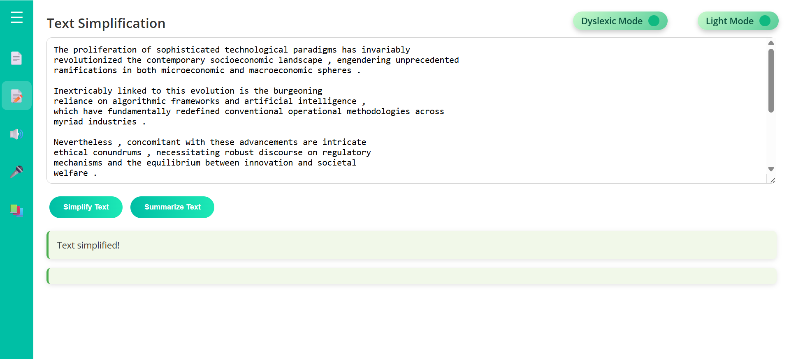
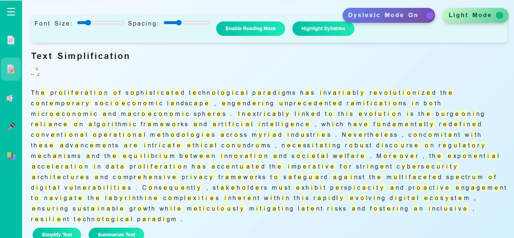
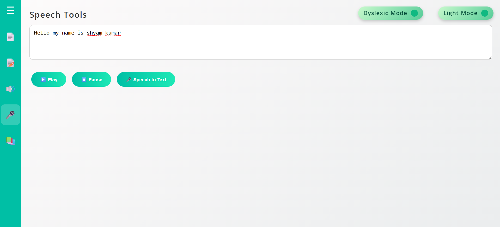
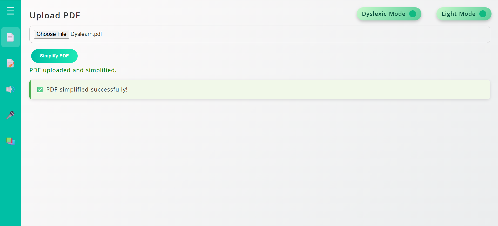

# Dyslearn: Simplifying Notes, Empowering Minds – Inclusive Tools for Dyslexic Students in Bharat  🎓📚✨

[](LICENSE)  [](https://github.com/shyam242/Dyslearn)

---

## Table of Contents  📑

- [Overview](#overview)  
- [Problem Statement](#problem-statement)  
- [Solution Highlights](#solution-highlights)  
- [Tech Stack](#tech-stack)  
- [Architecture](#architecture)  
- [Features](#features)  
- [Demo Screenshots](#demo-screenshots)  
- [Folder Structure](#folder-structure)  
- [Setup Instructions](#setup-instructions)  
- [Contribution Guidelines](#contribution-guidelines)  
- [License](#license)  
- [Team and Acknowledgements](#team-and-acknowledgements)  
- [Get Involved](#get-involved)  
- [FAQ](#faq)  

---

## Overview  🌟

I have always wondered that instead of changing student to fit in the system why not change system so that most of the students can fit in it. Therefore we made Dyslearn.Dyslearn is an **inclusive educational tool** designed to simplify notes and empower learning for dyslexic students in India. Targeted primarily at primary and middle-grade students, as well as their parents and educators, Dyslearn addresses the unique challenges faced by dyslexic learners in the Indian context. By focusing on **accessibility**, **regional diversity**, and **offline usability**, Dyslearn aims to bridge the gap in educational resources for dyslexic students across Bharat.

> 💡 *Empowering every learner with accessible education tailored to their needs.*

---

## Problem Statement  ❗

In India, 5–15% of students face dyslexia-related learning barriers, leading to high dropout rates, frustration, and significant academic challenges. Existing tools are often too dense, lack personalization, and do not support Indian languages or regional diversity. Moreover, many solutions are inaccessible offline and are not adapted to the cultural and linguistic contexts of Indian learners, leaving a large portion of dyslexic students underserved.

---

## Solution Highlights  🚀

- ✨ Text Simplification Engine tailored for dyslexic learners  
- 🔊 Text-to-Speech and Voice-to-Text capabilities  
- 🔤 Dyslexia-Friendly Fonts including Lexend and OpenDyslexic  
- 🎯 Special Dyslexic Mode featuring spacing adjustments, highlights, and syllable markers  
- ✅ Pronunciation Checker to aid reading accuracy  
- 📄 Offline PDF Generator for accessible study materials  
- 🌐 Multilingual Support (currently in progress)  
- 📱 Mobile-first design with AI-enabled reading level adaptation planned for future releases  

---

## Tech Stack  🛠️

- **Frontend:** HTML, CSS, React (optional)  
- **Backend:** Flask  
- **Libraries:** NLTK, gTTS  
- **Fonts:** Lexend, OpenDyslexic  

---

## Architecture  🏗️

Dyslearn follows a modular architecture where the frontend interface communicates with the Flask backend. The backend handles text simplification, text-to-speech, voice-to-text processing, and PDF generation. The flow can be summarized as:

**Frontend → Backend → PDF/Audio/NLP Processing**

This design ensures scalability and ease of integration for future features like multilingual support and AI-driven reading adaptation.

---

## Features  ✨

| Feature                 | Dyslearn                          | Traditional Tools               |
|-------------------------|----------------------------------|--------------------------------|
| Text Simplification     | ✔️ Tailored for dyslexic learners | ❌ Often too dense and complex  |
| Audio Support          | ✔️ Text-to-Speech & Voice-to-Text | ❌ Limited or no audio features |
| Regional Language Support | ✔️ Multilingual (in progress)     | ❌ Mostly English only          |
| Dyslexia-Friendly Fonts | ✔️ Lexend, OpenDyslexic           | ❌ Standard fonts               |
| Dyslexic Mode          | ✔️ Spacing, highlights, syllable markers | ❌ Not available               |
| Offline Access         | ✔️ PDF Generator                  | ❌ Mostly online only           |
| AI Reading Adaptation  | ✔️ Planned for future             | ❌ Not available                |

### Dyslexic Mode  💡

Dyslexic Mode enhances readability by adjusting text spacing, adding highlights, and marking syllables to reduce visual stress and improve comprehension for dyslexic students.

---

## 🖼️ Screenshots

### 🔹 Text Simplification vs Dyslexic Mode

| Text Simplification | Dyslexic Mode |
|----------------------|----------------------|
|  <br> *Simplified content for easier reading.* |  <br> *Increased spacing, special fonts, and highlights.* |

---

### 🔹 Text-to-Speech vs Pronunciation Checker

| Text-to-Speech | Pronunciation Checker |
|----------------------|----------------------|
|  <br> *Audio controls for listening to text.* |  <br> *Interactive pronunciation feedback.* |

---

### 🔹 Offline PDF Output

| PDF Generator |
|---------------|
|  <br> *Preview of simplified PDF generated offline.* |

---

## Folder Structure  📁

- `/frontend` → UI interface  
- `/backend` → Flask application  
- `/nlp` → Text simplification logic  
- `/audio` → Text-to-Speech modules  
- `/fonts` → Dyslexic and custom fonts  
- `/pdf` → PDF generation scripts  

---

## Setup Instructions  ⚙️

1. Ensure Python 3.7+ is installed.  
2. Clone the repository:  
   ```bash
   git clone https://github.com/shyam242/Dyslearn.git
   cd Dyslearn
   ```  
3. Create and activate a virtual environment:  
   ```bash
   python -m venv venv
   venv\Scripts\activate   # Windows  
   source venv/bin/activate  # macOS/Linux  
   ```  
4. Install dependencies:  
   ```bash
   pip install -r requirements.txt
   ```  
5. Run the Flask backend:  
   ```bash
   python backend.py
   ```  
6. Open the frontend in a browser or run the React app if applicable.

---

## Contribution Guidelines  🤝

We welcome contributions from the community! You can help by:

- Reporting issues and bugs  
- Suggesting new features  
- Improving documentation  
- Assisting with multilingual support (currently in progress)  

Please fork the repository and submit pull requests for review.

---

## License  📄

This project is licensed under the MIT License. See the [LICENSE](LICENSE) file for details.

---

## Team and Acknowledgements  🙌

### Team

- **Shyam Kumar**  
  GitHub: [shyam242](https://github.com/shyam242)  
  LinkedIn: [Shyam Kumar](https://www.linkedin.com/in/shyam2402)  

- **Ayush Kumar**  
  GitHub: [kumarayush0104](https://github.com/kumarayush0104)  
  LinkedIn: [Ayush Kumar](https://www.linkedin.com/in/kumarayush0104)  

### Acknowledgements

Special thanks to Dyslexia NGOs, Code for Bharat, and the open-source communities behind tools like gTTS and NLTK for their invaluable support.

---

## Get Involved  🌱

Interested in contributing? Join us in making Dyslearn better for everyone! Check out the [Contribution Guidelines](#contribution-guidelines) and submit your pull requests.

---

## FAQ  ❓

**Q:** Is Dyslearn available offline?  
**A:** Yes, Dyslearn supports offline PDF generation for accessible study materials.

**Q:** Are Indian regional languages supported?  
**A:** Multilingual support is currently in progress and will be available soon.

**Q:** How can I contribute?  
**A:** Please refer to the Contribution Guidelines section above.

---

GitHub Repo: [https://github.com/shyam242/Dyslearn](https://github.com/shyam242/Dyslearn)
